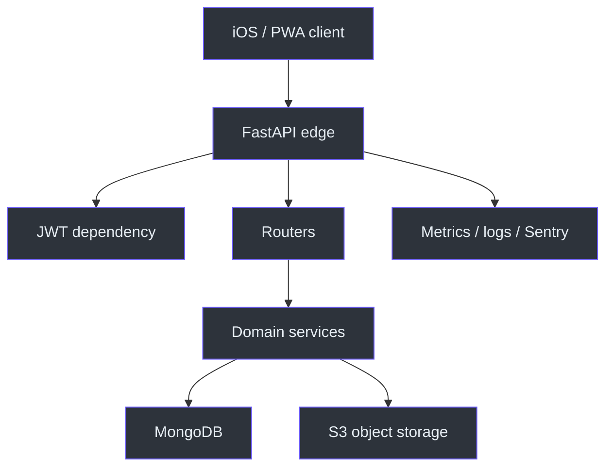
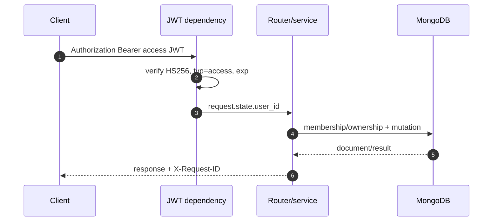
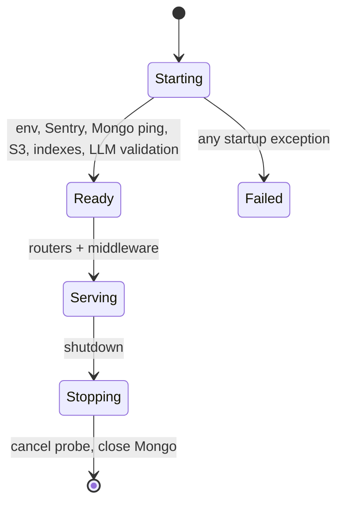

# Архитектура

## Обзор

Backend — единственный источник истины для пользователей, событий и денежных операций: клиент передаёт намерение, а API устанавливает личность, проверяет право на ресурс и только затем изменяет MongoDB. Это отделяет недоверенный iOS/PWA-клиент от доменных правил и делает один и тот же контракт доступным обоим клиентам. Приложение собирает FastAPI, общую bearer-зависимость и все роутеры в `create_app`. [app/main.py:223-248](https://github.com/Strongf-bob/SplitAppBackend/blob/main/app/main.py#L223-L248)

| Слой | Ответственность | Source |
|---|---|---|
| Edge/API | HTTP, CORS, request ID, router dispatch и статические PWA-маршруты | [app/main.py:43-71](https://github.com/Strongf-bob/SplitAppBackend/blob/main/app/main.py#L43-L71) |
| Identity | Yandex login, JWT access и refresh-token rotation | [app/routers/auth.py:13-31](https://github.com/Strongf-bob/SplitAppBackend/blob/main/app/routers/auth.py#L13-L31) |
| Domain services | Membership/creator checks, lifecycle, расчёты и storage workflows | [app/services/access.py:14-69](https://github.com/Strongf-bob/SplitAppBackend/blob/main/app/services/access.py#L14-L69) |
| Persistence | MongoDB, startup indexes и TTL | [app/core/db.py:67-106](https://github.com/Strongf-bob/SplitAppBackend/blob/main/app/core/db.py#L67-L106) |
| External systems | Yandex OAuth, S3-compatible storage, Sentry, LLM provider | [app/core/s3.py:13-47](https://github.com/Strongf-bob/SplitAppBackend/blob/main/app/core/s3.py#L13-L47) |

<!-- Sources: app/main.py:223-248, app/dependencies.py:86-148, app/core/db.py:67-94, app/core/s3.py:46-50 -->

## Доверительные границы

| Граница | Что принимается | Контроль | Source |
|---|---|---|---|
| Интернет → API | HTTP payload, bearer token, request ID | Pydantic router schemas, global dependency, explicit CORS | [app/dependencies.py:86-137](https://github.com/Strongf-bob/SplitAppBackend/blob/main/app/dependencies.py#L86-L137) |
| API → domain | `actor_user_id` и validated fields | service проверяет membership, creator и `is_closed` | [app/services/access.py:33-69](https://github.com/Strongf-bob/SplitAppBackend/blob/main/app/services/access.py#L33-L69) |
| API → Mongo | сервисные запросы | connection ping на startup, indexes до обработки трафика | [app/main.py:192-202](https://github.com/Strongf-bob/SplitAppBackend/blob/main/app/main.py#L192-L202) |
| API → storage | ключи S3 и object keys | ключи только из окружения; объектный клиент хранится в `app.state` | [app/core/s3.py:19-47](https://github.com/Strongf-bob/SplitAppBackend/blob/main/app/core/s3.py#L19-L47) |
| Ops → диагностические API | `/api/metrics`, `/api/health/db` | отдельный bearer-secret либо private/loopback network; иначе 404 | [app/dependencies.py:17-25](https://github.com/Strongf-bob/SplitAppBackend/blob/main/app/dependencies.py#L17-L101) |

## Ключевые пути

### Обычный защищённый запрос

<!-- Sources: app/core/tokens.py:39-61, app/dependencies.py:86-148, app/services/access.py:33-69, app/main.py:111-139 -->

Проверка токена происходит до защищённых API-маршрутов, а `get_actor_user_id` берёт только вычисленный сервером `request.state.user_id`; клиентский `user_id` не становится actor. [app/dependencies.py:106-148](https://github.com/Strongf-bob/SplitAppBackend/blob/main/app/dependencies.py#L106-L148) Для event-ресурсов активное membership — это `status: active` и отсутствие `deleted_at`; закрытое событие возвращает 409 для модификаций. [app/services/access.py:21-61](https://github.com/Strongf-bob/SplitAppBackend/blob/main/app/services/access.py#L21-L61)

### Startup и отказ

<!-- Sources: app/main.py:192-220, app/core/db.py:67-98, app/services/indexes.py:4-67 -->

Lifespan намеренно не начинает обслуживание с недоступной базой: ошибка подключения, создания индексов или обязательной LLM-конфигурации превращается в `RuntimeError`. [app/main.py:192-202](https://github.com/Strongf-bob/SplitAppBackend/blob/main/app/main.py#L192-L202)

## Наблюдаемость

Каждый запрос получает входящий или новый UUID, возвращается с `X-Request-ID`, записывается структурированным JSON и наблюдается как count/duration с template path, а не с raw URL. [app/main.py:74-139](https://github.com/Strongf-bob/SplitAppBackend/blob/main/app/main.py#L74-L139) Prometheus определяет отдельные HTTP, service, DB, domain и money метрики. [app/core/monitoring.py:13-75](https://github.com/Strongf-bob/SplitAppBackend/blob/main/app/core/monitoring.py#L13-L75)

## Связанные страницы

| Page | Relationship |
|---|---|
| [Модель данных](Data-Model.md#коллекции-и-владение) | Определяет persistent state доменных сервисов. |
| [Аутентификация и безопасность](Authentication-And-Security.md#модель-аутентификации) | Детализирует границу клиента и API. |
| [Операции и деплой](Operations-And-Deployment.md#runtime-и-наблюдаемость) | Описывает Compose и production-эксплуатацию. |
| [Тесты и CI](Testing-And-CI.md#пирамида-проверок) | Фиксирует проверку архитектурных контрактов. |
