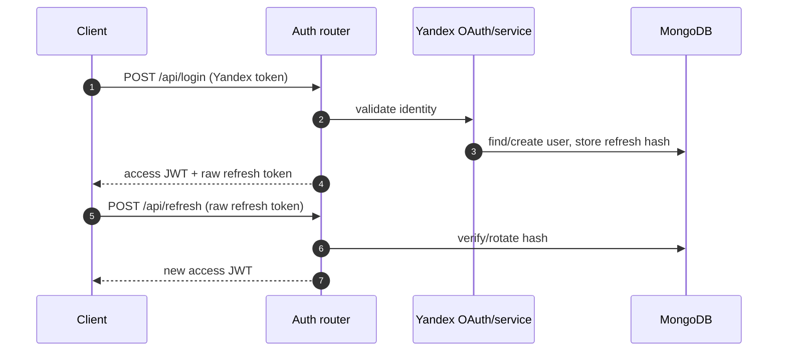
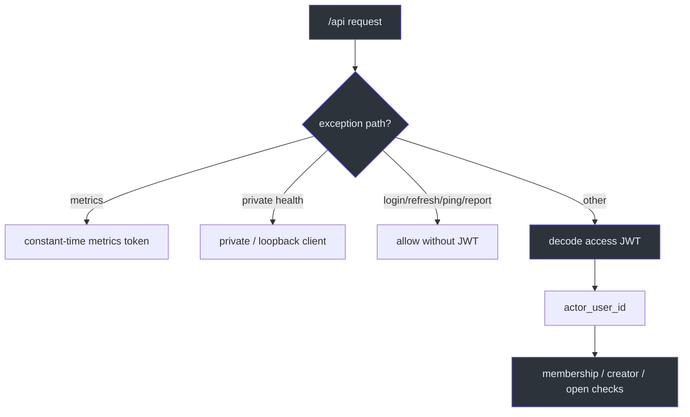

# Аутентификация и безопасность

## Модель аутентификации

Yandex OAuth подтверждает внешнюю личность только в `POST /api/login`; после этого backend выдаёт собственные короткоживущие access JWT и refresh token. Login и refresh имеют rate limit по адресу клиента. [app/routers/auth.py:13-31](https://github.com/Strongf-bob/SplitAppBackend/blob/main/app/routers/auth.py#L13-L31)

| Артефакт | Состав / срок | Где проверяется | Источник |
|---|---|---|---|
| Access token | HS256 JWT: `sub`, `typ=access`, `iat`, `exp`; по умолчанию 15 min | global dependency | [app/core/tokens.py:24-61](https://github.com/Strongf-bob/SplitAppBackend/blob/main/app/core/tokens.py#L24-L61) |
| Refresh token | случайная URL-safe строка; по умолчанию 30 days | hash в Mongo, rotation auth service | [app/core/tokens.py:29-36](https://github.com/Strongf-bob/SplitAppBackend/blob/main/app/core/tokens.py#L29-L36) |
| Metrics token | отдельный bearer secret | только `/api/metrics` | [app/dependencies.py:22-25](https://github.com/Strongf-bob/SplitAppBackend/blob/main/app/dependencies.py#L22-L25) |

<!-- Sources: app/routers/auth.py:13-31, app/core/tokens.py:39-69, app/services/indexes.py:18-19 -->

## Авторизация ресурсов

Global dependency применяется ко всему `/api/*`, кроме явного allow-list (`/api/ping`, login, refresh, client reports); не-API static routes не требуют bearer. [app/dependencies.py:27-104](https://github.com/Strongf-bob/SplitAppBackend/blob/main/app/dependencies.py#L27-L104) После cryptographic validation actor берётся только из `request.state.user_id`. [app/dependencies.py:106-148](https://github.com/Strongf-bob/SplitAppBackend/blob/main/app/dependencies.py#L106-L148)

<!-- Sources: app/dependencies.py:17-148, app/services/access.py:33-69 -->

Для event API service требует active membership; creator-only actions сравнивают actor с `event.creator_id`; финансовые записи в закрытом event запрещены. [app/services/access.py:33-69](https://github.com/Strongf-bob/SplitAppBackend/blob/main/app/services/access.py#L33-L69) Эти проверки должны оставаться в service layer, а не в UI.

## Refresh-токены и секреты

Raw refresh token не является persistent data: функция хранения преобразует его в SHA-256, а MongoDB TTL автоматически удаляет документ после `expires_at`. [app/core/tokens.py:64-69](https://github.com/Strongf-bob/SplitAppBackend/blob/main/app/core/tokens.py#L64-L69) `JWT_SECRET` обязателен; отсутствие даёт generic 500 и server-side log, а не обход authentication. [app/core/tokens.py:12-21](https://github.com/Strongf-bob/SplitAppBackend/blob/main/app/core/tokens.py#L12-L21)

S3 credentials читаются из environment и не попадают в API response или Git; endpoint и region имеют безопасные defaults для Yandex Object Storage. [app/core/s3.py:9-43](https://github.com/Strongf-bob/SplitAppBackend/blob/main/app/core/s3.py#L9-L43) Mongo URI может использовать managed-cluster TLS и CA file. [app/core/db.py:32-90](https://github.com/Strongf-bob/SplitAppBackend/blob/main/app/core/db.py#L32-L90)

## CORS, ошибки и auditability

CORS разрешает только список development/production origins либо явный `CORS_ALLOWED_ORIGINS`; credentials разрешены, поэтому wildcard здесь намеренно не применяется. [app/main.py:43-71](https://github.com/Strongf-bob/SplitAppBackend/blob/main/app/main.py#L43-L71) Необработанная ошибка раскрывается клиенту только как `Internal server error.`, а диагностические type/message идут в server log вместе с request ID. [app/main.py:91-108](https://github.com/Strongf-bob/SplitAppBackend/blob/main/app/main.py#L91-L108)

## Связанные страницы

| Страница | Связь |
|---|---|
| [Архитектура](Architecture#доверительные-границы) | Карта доверительных границ. |
| [Модель данных](Data-Model#коллекции-и-владение) | Показывает владение данными и TTL-коллекции. |
| [Операции и деплой](Operations-And-Deployment#runtime-и-наблюдаемость) | Описывает хранение секретов времени выполнения и закрытые метрики. |
| [Тесты и CI](Testing-And-CI#регрессионные-контракты) | Фиксирует ожидания к регрессионным проверкам безопасности. |
