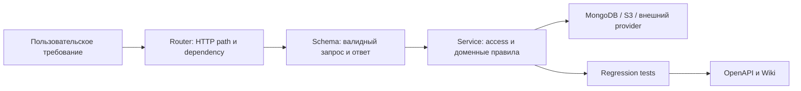

# Руководство contributor

Этот маршрут для инженера, который вносит ограниченное изменение в backend. Цель — не просто найти endpoint, а сохранить контракт, серверную авторизацию и наблюдаемость в согласованном состоянии.

## Первые 30 минут

1. Прочитайте [Обзор продукта](Product-Overview) и [Архитектуру](Architecture), чтобы не смешать доменный сценарий, router, schema и service responsibility.
2. Подготовьте локальный запуск: создайте `.venv`, установите `requirements.txt`, скопируйте `.env.example` в `.env`, задайте MongoDB и обязательный `JWT_SECRET`, затем выполните `make run`. Параметры и команды определены в [README](https://github.com/Strongf-bob/SplitAppBackend/blob/main/README.md) и [Makefile:13-44](https://github.com/Strongf-bob/SplitAppBackend/blob/main/Makefile#L13-L44).
3. Запустите исходный baseline:

   ```bash
   make test
   make lint
   make format-check
   git diff --check
   ```

4. Для API-задачи начните с [Руководства по API](API-Guide) и [openapi.yaml](https://github.com/Strongf-bob/SplitAppBackend/blob/main/openapi.yaml), а затем найдите router и service по предметной области.
5. Перед правкой финансового сценария прочитайте [Деньги и взаиморасчёты](Money-And-Settlement), [Жизненный цикл чека](Receipt-Lifecycle) и [Аутентификацию и безопасность](Authentication-And-Security).


<!-- Sources: app/main.py:223-248, app/routers, app/schemas.py, app/services -->

## Карта кода

| Что меняется | Сначала читать | Затем проверить |
|---|---|---|
| Вход, access/refresh token | [auth router](https://github.com/Strongf-bob/SplitAppBackend/blob/main/app/routers/auth.py#L13-L31), [token helpers](https://github.com/Strongf-bob/SplitAppBackend/blob/main/app/core/tokens.py#L12-L69) | Allow-list, rotation, rate limit и отсутствие raw refresh-token в persistence. |
| Событие, участник, приглашение | [events router](https://github.com/Strongf-bob/SplitAppBackend/blob/main/app/routers/events.py#L12-L245), [events service](https://github.com/Strongf-bob/SplitAppBackend/blob/main/app/services/events.py#L230-L480) | Active membership, creator-only изменение состава и аудит lifecycle. |
| Чек, доли, изображение | [receipts router](https://github.com/Strongf-bob/SplitAppBackend/blob/main/app/routers/receipts.py#L22-L304), [receipts service](https://github.com/Strongf-bob/SplitAppBackend/blob/main/app/services/receipts.py#L226-L970) | Membership, open event, подтверждение до учёта в балансе и private storage. |
| Баланс, план расчёта, платёж | [balances service](https://github.com/Strongf-bob/SplitAppBackend/blob/main/app/services/balances.py#L32-L172), [payments service](https://github.com/Strongf-bob/SplitAppBackend/blob/main/app/services/payments.py#L76-L697) | Целые копейки, event scope, роли должника/получателя и подтверждение платежа. |
| Splitik | [splitik router](https://github.com/Strongf-bob/SplitAppBackend/blob/main/app/routers/splitik.py#L14-L102), [guardrails](https://github.com/Strongf-bob/SplitAppBackend/blob/main/app/services/splitik_guardrails.py#L119-L152) | Вложение, сессия и явное подтверждение черновика до write action. |
| Runtime, логи, метрики | [application wiring](https://github.com/Strongf-bob/SplitAppBackend/blob/main/app/main.py#L91-L139), [Compose runtime](https://github.com/Strongf-bob/SplitAppBackend/blob/main/compose.yaml#L3-L178) | Request ID, generic error, healthcheck и непубличные observability interfaces. |

## Порядок безопасного изменения

1. Сформулируйте domain invariant и actor, которому разрешено действие. Не принимайте user ID из тела запроса за доказательство полномочий: actor берётся из аутентификации, а доступ к событию — из membership. [Проверки доступа](https://github.com/Strongf-bob/SplitAppBackend/blob/main/app/services/access.py#L14-L69)
2. Проверьте, затрагивает ли изменение жизненный цикл: мягко удалённые ресурсы не должны возвращаться в API, а закрытое событие отклоняет финансовые изменения. [Модель данных](Data-Model#состояния-и-soft-delete)
3. Измените schema и router только после того, как service задаёт полный серверный инвариант. Request validation — UX и защита границы, но не замена authorization.
4. Добавьте либо обновите регрессионные тесты для нового разрешённого и запрещённого пути. Матрица обязательных фокусов есть в [Тестах и CI](Testing-And-CI#регрессионные-контракты).
5. Для внешнего API синхронно обновите runtime `app.openapi()`, [openapi.yaml](https://github.com/Strongf-bob/SplitAppBackend/blob/main/openapi.yaml), [API guide](API-Guide) и релевантную продуктовую Wiki-страницу.
6. Перед commit повторите baseline; при изменении deployment/runtime добавьте Compose smoke, при изменении документации — проверку ссылок из [Поддержки Wiki](Wiki-Maintenance#локальная-проверка-документации).

## На что обращать особое внимание

| Риск | Почему он важен | Контроль |
|---|---|---|
| Подмена actor | Клиент может прислать любой идентификатор. | Использовать authenticated actor и membership/creator checks в service. |
| Неверная денежная семантика | Расчёт и платёж — разные состояния; неверный subtotal меняет долг. | Работать с integer kopecks и подтверждёнными источниками баланса. |
| Расширение доступа | Новый list/detail endpoint может раскрыть чужое событие. | Проверять membership до query и вводить pagination для новых списков. |
| Расхождение контракта | Клиент, OpenAPI и runtime начинают говорить на разных языках. | Обновлять schemas, runtime OpenAPI, committed spec, tests и Wiki одной задачей. |
| Ложная эксплуатационная уверенность | Локально работающий API не равен production runtime. | Сверяться с [Операциями и деплоем](Operations-And-Deployment) и CI gates. |

## Связанные страницы

| Страница | Связь |
|---|---|
| [Этот раздел: первые 30 минут](#первые-30-минут) | Окружение и первый run. |
| [API guide](API-Guide) | Правила совместимого изменения контракта. |
| [Тесты и CI](Testing-And-CI) | Обязательные локальные и CI gates. |
| [Руководство staff engineer](Staff-Engineer-Guide) | Архитектурные trade-offs и cross-cutting риски. |
| [Поддержка Wiki](Wiki-Maintenance) | Документация как часть изменения. |
