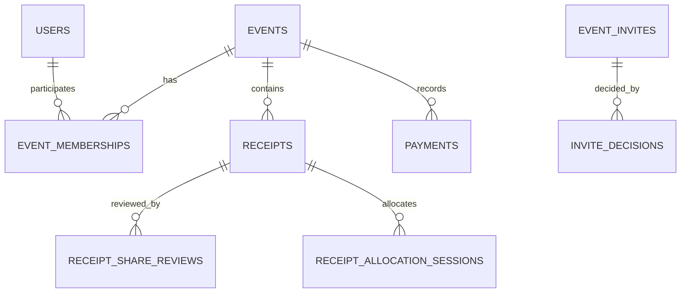
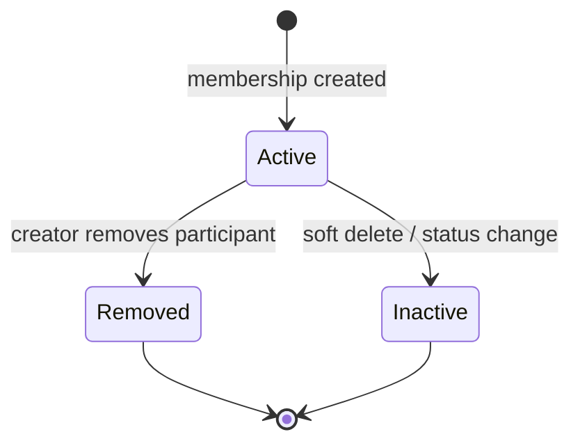

# Модель данных

## Обзор

MongoDB хранит нормализованные по ownership документы: event не содержит доверенный список участников, а доступ определяется активной записью `event_memberships`. Такой выбор позволяет отзывать участие мягко и проверять его в каждом защищённом service path. [app/services/access.py:21-49](https://github.com/Strongf-bob/SplitAppBackend/blob/main/app/services/access.py#L21-L49)

| Группа | Коллекции | Ключ ownership / связи | Source |
|---|---|---|---|
| Identity | `users`, `refresh_tokens`, `user_contacts` | `users.id`; refresh хранит только `token_hash`; contacts принадлежат `owner_user_id` | [app/services/indexes.py:5-19](https://github.com/Strongf-bob/SplitAppBackend/blob/main/app/services/indexes.py#L5-L19) |
| Social | `friends`, `event_invites`, `invite_decisions` | pair/event/invite + actor; unique pair и decision | [app/services/indexes.py:10-31](https://github.com/Strongf-bob/SplitAppBackend/blob/main/app/services/indexes.py#L10-L31) |
| Event | `events`, `event_memberships` | `creator_id`, `(event_id,user_id)` | [app/services/indexes.py:20-23](https://github.com/Strongf-bob/SplitAppBackend/blob/main/app/services/indexes.py#L20-L23) |
| Money | `receipts`, reviews, allocations, claims, `payments`, requests, plans | `event_id`, receipt/session/settlement references | [app/services/indexes.py:32-57](https://github.com/Strongf-bob/SplitAppBackend/blob/main/app/services/indexes.py#L32-L57) |
| Support | `disputes`, `client_feedback_reports`, `idempotency_keys` | resource/event, actor/request | [app/services/indexes.py:58-67](https://github.com/Strongf-bob/SplitAppBackend/blob/main/app/services/indexes.py#L58-L67) |

<!-- Sources: app/services/indexes.py:20-57, app/services/access.py:21-49 -->

## Коллекции и владение

| Коллекция | Инвариант и статусы | Основные индексы | Source |
|---|---|---|---|
| `users` | Stable `id`; OAuth identity — optional `yandex_id`; профиль может иметь `avatar_key`, discovery fields | unique `id`, `phone_number`, sparse unique `yandex_id`/`public_handle` | [app/services/indexes.py:5-9](https://github.com/Strongf-bob/SplitAppBackend/blob/main/app/services/indexes.py#L5-L9) |
| `refresh_tokens` | сервер хранит SHA-256 hash, а не raw refresh token; `expires_at` удаляется TTL | unique `token_hash`, TTL `expires_at` | [app/core/tokens.py:64-69](https://github.com/Strongf-bob/SplitAppBackend/blob/main/app/core/tokens.py#L64-L69) |
| `events` + memberships | event принадлежит `creator_id`; membership active только при `status=active` без `deleted_at`; event может быть `is_closed` | unique event ID, unique `(event_id,user_id)`, user/status | [app/services/access.py:21-69](https://github.com/Strongf-bob/SplitAppBackend/blob/main/app/services/access.py#L21-L69) |
| `event_invites` + decisions | invite имеет token и lifecycle `active`/revoked/expired; решение уникально на invite+user+type | unique token; unique decision triple | [app/services/indexes.py:24-31](https://github.com/Strongf-bob/SplitAppBackend/blob/main/app/services/indexes.py#L24-L31) |
| `receipts` | расходы связаны с event, имеют lifecycle `status`; active reads отбрасывают soft-deleted records | unique id; `(event_id,created_at)`, `(event_id,status)` | [app/services/indexes.py:32-34](https://github.com/Strongf-bob/SplitAppBackend/blob/main/app/services/indexes.py#L32-L34) |
| allocations/reviews | reviews уникальны на receipt/user; claims индексируются по session/item и session/user | unique review pair; session-oriented indexes | [app/services/indexes.py:35-43](https://github.com/Strongf-bob/SplitAppBackend/blob/main/app/services/indexes.py#L35-L43) |
| payments/plans | платежи и планы привязаны к event; request может ссылаться на settlement edge | event/time; unique sparse plan-edge; sparse active key | [app/services/indexes.py:44-57](https://github.com/Strongf-bob/SplitAppBackend/blob/main/app/services/indexes.py#L44-L57) |
| `idempotency_keys` | identity операции — actor + scope + client key; мусор удаляется через 24h TTL | unique actor/scope/key, TTL created_at | [app/services/indexes.py:66-67](https://github.com/Strongf-bob/SplitAppBackend/blob/main/app/services/indexes.py#L66-L67) |

## Состояния и soft delete

<!-- Sources: app/services/access.py:21-49, app/services/events.py:456-476 -->

`get_event_or_404`, `get_receipt_or_404` и `get_payment_or_404` используют `active_filter`, поэтому deleted records не должны снова становиться API-ресурсами. [app/services/access.py:14-18](https://github.com/Strongf-bob/SplitAppBackend/blob/main/app/services/access.py#L14-L18) Денежные модификации обязаны дополнительно пройти `assert_event_open`. [app/services/access.py:56-61](https://github.com/Strongf-bob/SplitAppBackend/blob/main/app/services/access.py#L56-L61)

## Индексы как контракт

Индексы создаются на startup до готовности приложения; это не миграция «по желанию». [app/main.py:192-202](https://github.com/Strongf-bob/SplitAppBackend/blob/main/app/main.py#L192-L202) Unique indexes защищают идентичность и повторную обработку, TTL ограничивает refresh/idempotency state, а compound indexes соответствуют реальным выборкам: event timeline, active membership и inbox payment requests. [app/services/indexes.py:18-67](https://github.com/Strongf-bob/SplitAppBackend/blob/main/app/services/indexes.py#L18-L67)

## Связанные страницы

| Page | Relationship |
|---|---|
| [Архитектура](Architecture.md#доверительные-границы) | Объясняет, где ownership проверяется. |
| [Аутентификация и безопасность](Authentication-And-Security.md#refresh-токены-и-секреты) | Описывает lifecycle refresh-token state. |
| [Деньги и расчёты](Money-And-Settlement.md) | Объясняет business-meaning receipts, payments и plans. |
| [Операции и деплой](Operations-And-Deployment.md#backup-и-восстановление) | Покрывает эксплуатацию MongoDB state. |
