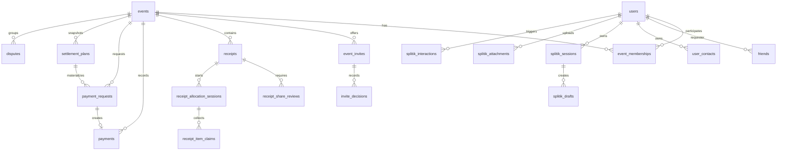

# Data model

Этот документ описывает внутреннюю модель данных SplitAppBackend: основные
MongoDB collections, связи между ними, lifecycle статусы и правила хранения.
API-контракт остается в `openapi.yaml`, а эта страница нужна для разработки
service-layer изменений и ревью backend-логики.

## Короткая схема

Главная бизнес-ось:

1. `users` входят в `events` через `event_memberships`.
2. `receipts` и `payments` принадлежат событию.
3. Balances не хранятся как отдельная collection: они рассчитываются из
   confirmed receipts и confirmed payments.
4. AI/Splitik не пишет confirmed деньги напрямую: он создает drafts, которые
   применяются через backend commit flow.

## Collections

| Collection | Назначение | Ключевые связи |
| --- | --- | --- |
| `users` | Профиль пользователя после Yandex login, discovery и payment hints. | `id` используется во всех actor/member/payment связях. |

Для Yandex-пользователя документ также содержит `yandex_id`, `yandex_profile_imported_at` и, при успешной загрузке изображения, `avatar_key`. Поля фиксируют разовый импорт профиля и backend-owned аватар; локальный iOS-кэш удаляется при logout или невалидной refresh-сессии.
| `refresh_tokens` | Hash refresh token, срок жизни и факт использования. | `user_id -> users.id`. |
| `friends` | Private friendship flow: request, accept, reject, block, remove. | `requester_id/addressee_id -> users.id`, `pair_key` уникален. |
| `user_contacts` | Импортированные контакты текущего пользователя. | `owner_user_id -> users.id`, optional `matched_user_id -> users.id`. |
| `events` | Пространство общих расходов и event-level настройки. | `creator_id -> users.id`. |
| `event_memberships` | Источник правды для доступа к событию. | `event_id -> events.id`, `user_id -> users.id`. |
| `event_invites` | Invite token/link для вступления в событие. | `event_id -> events.id`, `created_by -> users.id`. |
| `invite_decisions` | Решение пользователя по invite: accept/decline. | `invite_id -> event_invites.id`, `user_id -> users.id`. |
| `receipts` | Draft/confirmed/voided/corrected чек с embedded items и shares. | `event_id -> events.id`, `payer_id -> users.id`. |
| `receipt_share_reviews` | Review долей участниками перед подтверждением. | `receipt_id -> receipts.id`, `user_id -> users.id`. |
| `receipt_allocation_sessions` | Совместная сессия распределения позиций чека. | `receipt_id -> receipts.id`, `created_by -> users.id`. |
| `receipt_item_claims` | Claims пользователей на позиции во время allocation session. | `session_id -> receipt_allocation_sessions.id`, `user_id -> users.id`. |
| `receipt_ai_drafts` | AI draft чека из текста с результатами primary/verification/escalation моделей. | `event_id -> events.id`, `owner_user_id -> users.id`. |
| `payments` | Заявление или подтвержденный платеж между участниками события. | `event_id -> events.id`, `sender_id/receiver_id -> users.id`. |
| `payment_requests` | Просьба оплатить долг, deadline и dispute/cancel/paid lifecycle. | `event_id -> events.id`, `debtor_id/creditor_id -> users.id`, optional settlement provenance через `origin`, `settlement_plan_id`, `settlement_edge_id`. |
| `settlement_plans` | Snapshot-backed план оптимизированных переводов внутри одного event. | `event_id -> events.id`, `created_by -> users.id`, `required_approver_ids` ссылаются на участников source graph. |
| `disputes` | Спор по receipt/payment/payment_request внутри события. | `event_id -> events.id`, `resource_id` указывает на спорный ресурс. |
| `audit_events` | Backend audit feed для важных действий. | `actor_user_id -> users.id`, resource fields describe target. |
| `idempotency_keys` | Защита financial create endpoints от повторной отправки. | `actor_user_id + scope + key` уникальны. |
| `splitik_sessions` | История Splitik-сессии текущего пользователя. | `owner_user_id -> users.id`. |
| `splitik_drafts` | Подтверждаемые draft actions Сплитика. | `owner_user_id -> users.id`, optional `event_id -> events.id`. |
| `splitik_attachments` | Private image attachments для Splitik message flow. | `owner_user_id -> users.id`. |
| `splitik_interactions` | Sanitized logs Splitik-запросов, guardrails, stages and diagnostics. | `actor_user_id -> users.id`, optional `session_id`. |

## Source-of-truth правила

| Данные | Источник правды | Что не считается источником правды |
| --- | --- | --- |
| Доступ к событию | Active `event_memberships` | Client-supplied `user_id`, legacy participant arrays, friends list. |
| Балансы | Runtime calculation from confirmed receipts and confirmed payments | Stored API response, client-side calculation, draft receipt. |
| Settlement optimization | Server-built snapshot из `raw_debts`, `net_positions`, `recommended_transfers` и active memberships | Client-submitted graph, guesses about direct receipt ownership, cross-event edge payload. |
| Деньги | Integer kopecks in API and MongoDB for new records | Float, double, decimal-string in new write contracts. |
| Receipt items/shares | Embedded `items` and `share_items` inside `receipts` | Legacy standalone `receipt_items` / `share_items` lookups. |
| Receipt image access | Private object storage plus presigned URL endpoint | Permanent public object URL. |
| Splitik writes | `splitik_drafts` plus explicit commit endpoint | LLM text, tool suggestion, frontend-only confirmation. |
| Repeated financial writes | `idempotency_keys` | Client retry assumptions. |

## Lifecycle статусы

| Объект | Основные статусы | Правило |
| --- | --- | --- |
| Event membership | `active`, removed/deleted state through soft-delete fields | Только active membership дает доступ к event data. |
| Event invite | active/revoked/accepted/expired by fields and TTL | Revoked/expired token не может добавить участника. |
| Receipt | `draft`, `collecting_shares`, `ready_for_review`, `pending_confirmation`, `confirmed`, `disputed`, `voided`, `corrected` | Только confirmed receipt влияет на balances; voided/corrected не должны создавать долг. |
| Receipt share review | `pending`, `accepted`, `disputed` | Dispute переводит чек в спорное состояние. |
| Allocation session | `collecting`, `ready`, `finalized` | Меняет shares только через controlled finalize flow. |
| Payment | `pending`, `confirmed`, `rejected` | Только confirmed payment уменьшает balances. |
| Payment request | `requested`, `paid`, `confirmed`, `rejected`, `cancelled`, `disputed` | `mark-paid` создает pending payment, confirmation делает его финансовым фактом. |
| Settlement plan | `pending`, `approved`, `rejected`, `stale`, `expired`, `executing`, `partially_settled`, `completed` | Create/execute только для open event; `required_approver_ids` покрывает весь source graph, включая net-zero intermediaries; `completed` достигается только через confirmed linked payments. |
| Dispute | `open`, `resolved` | Resolution не должна обходить authorization по event. |
| Splitik draft | `pending`, `committed`, cancelled/deleted terminal states | Pending draft можно редактировать; committed draft повторно не применяется. |

## Индексы и ограничения

Индексы создаются в `app/services/indexes.py`. Самые важные ограничения:

- `users.id`, `events.id`, `receipts.id`, `payments.id` и другие public ids
  уникальны.
- `event_memberships(event_id, user_id)` уникален: один membership record на
  пользователя в событии.
- `friends.pair_key` уникален: одна friendship-связь на пару пользователей.
- `user_contacts(owner_user_id, phone_hash)` уникален: один сохраненный контакт
  на нормализованный телефон владельца.
- `idempotency_keys(actor_user_id, scope, key)` уникален: один результат на
  idempotent financial request.
- `payment_requests(settlement_plan_id, settlement_edge_id)` unique sparse:
  не больше одного `payment_request` документа на каждую пару
  `(settlement_plan_id, settlement_edge_id)` независимо от статуса; повторные execute/retry
  должны переиспользовать уже существующий документ.
- `settlement_plans.active_key` unique sparse: один active plan на конкретный
  snapshot одного event.
- TTL есть у `refresh_tokens.expires_at` и `idempotency_keys.created_at`.

Pending settlement plan дополнительно живет 24 часа по полю `expires_at`; backend
переводит его в `expired` при чтении или mutation action, если TTL истек.

## Где смотреть детали

- API shape: `openapi.yaml` и [API](API-Reference).
- Бизнес-сценарии: [Доменные сценарии](Domain-Flows).
- Архитектура слоев: [Обзор проекта](Project-Overview).
- Splitik draft/commit модель: [Сплитик](Splitik-Agent).
- Production storage/runtime: [Операции и деплой](Operations-And-Deployment).
