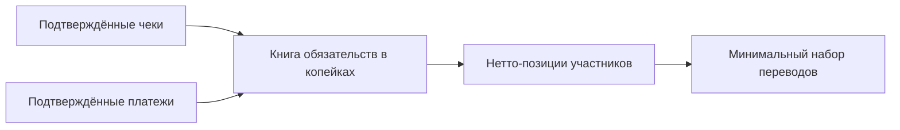
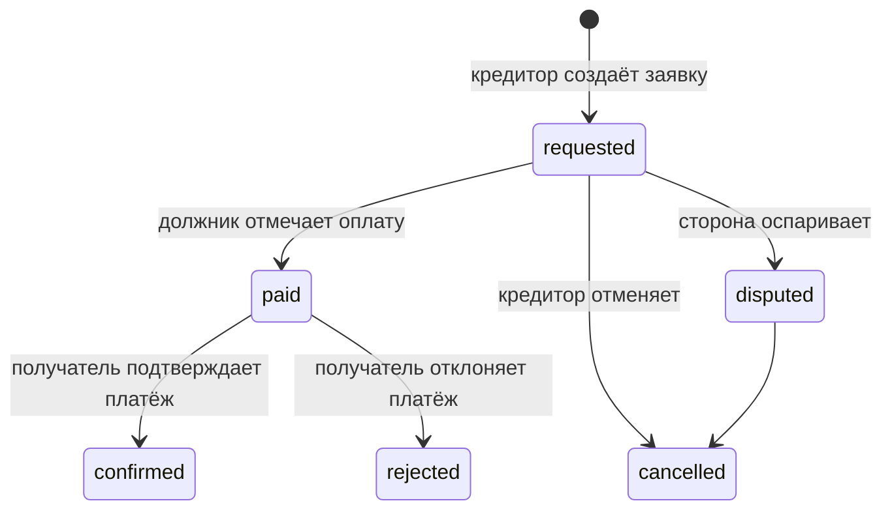

# Деньги и взаиморасчёты

Суммы в бизнес-операциях передаются и рассчитываются в **копейках** (`amount_kopecks`). Это исключает погрешность представления рублей с плавающей точкой; доля позиции округляется до целой копейки по правилу `ROUND_HALF_UP`. [Расчёт доли](https://github.com/Strongf-bob/SplitAppBackend/blob/main/app/services/balances.py#L24-L29).

## От чека к оптимальным переводам

| Этап | Правило | Источник |
|---|---|---|
| Источники | Берутся подтверждённые чеки и подтверждённые платежи | [выбор источников](https://github.com/Strongf-bob/SplitAppBackend/blob/main/app/services/balances.py#L32-L48) |
| Долг по позиции | Доля участника направляется от должника к плательщику чека | [построение книги](https://github.com/Strongf-bob/SplitAppBackend/blob/main/app/services/balances.py#L108-L146) |
| Взаимозачёт | Встречные долги одной пары сводятся в одну нетто-сумму | [парный неттинг](https://github.com/Strongf-bob/SplitAppBackend/blob/main/app/services/balances.py#L51-L94) |
| Оптимизация | Нетто-позиции должников и кредиторов сопоставляются на сумму минимума | [алгоритм рёбер](https://github.com/Strongf-bob/SplitAppBackend/blob/main/app/services/settlement_algorithm.py#L37-L65) |

<!-- Sources: app/services/balances.py:32-48, app/services/balances.py:97-161, app/services/settlement_algorithm.py:1-65 -->

Важно: сначала выполняется взаимозачёт парных обязательств, затем алгоритм строит переводы по суммарным позициям участников. Это не обещание банковского исполнения — лишь рекомендуемые суммы и направления.

## Заявка, платёж и спор

<!-- Sources: app/services/payments.py:304-362, app/services/payments.py:514-676, app/routers/payments.py:118-157 -->

| Действие | Кто делает | Защита | Источник |
|---|---|---|---|
| Создать заявку | Только кредитор, для двух разных участников события | Сумма положительна по схеме; стороны проверяются сервисом | [создание](https://github.com/Strongf-bob/SplitAppBackend/blob/main/app/services/payments.py#L304-L362) |
| Отметить «оплачено» | Только должник | Создаётся ожидающий подтверждения платёж | [mark paid](https://github.com/Strongf-bob/SplitAppBackend/blob/main/app/services/payments.py#L514-L557) |
| Подтвердить/отклонить | Стороны платежа | Перед действием выдаётся confirmation summary | [API подтверждения](https://github.com/Strongf-bob/SplitAppBackend/blob/main/app/routers/payments.py#L118-L157), [summary](https://github.com/Strongf-bob/SplitAppBackend/blob/main/app/services/payments.py#L679-L710) |
| Оспорить заявку | Любая из двух сторон | Допустимо только для активных статусов | [спор заявки](https://github.com/Strongf-bob/SplitAppBackend/blob/main/app/services/payments.py#L654-L676) |
| Вести отдельный спор | Участник события | Есть создание, список и разрешение | [disputes API](https://github.com/Strongf-bob/SplitAppBackend/blob/main/app/routers/disputes.py#L12-L39) |

## План расчётов и закрытие события

План создаётся для события с ключом идемпотентности, затем его можно одобрить, исполнить или отклонить. Для ребра плана заявка связывается с конкретным планом и ребром; повторное создание возвращает уже существующую согласованную заявку. [Маршруты плана](https://github.com/Strongf-bob/SplitAppBackend/blob/main/app/routers/events.py#L181-L245), [связь заявки с ребром](https://github.com/Strongf-bob/SplitAppBackend/blob/main/app/services/payments.py#L418-L477).

## Связанные страницы

| Страница | Связь |
|---|---|
| [Обзор продукта](Product-Overview) | Граница учёта и реального перевода |
| [Путь пользователя](User-Journey) | Действия сторон платежа |
| [Жизненный цикл чека](Receipt-Lifecycle) | Откуда возникают обязательства |
| [Помощник Splitik](Splitik-Assistant) | Помощник не подтверждает платежи |
