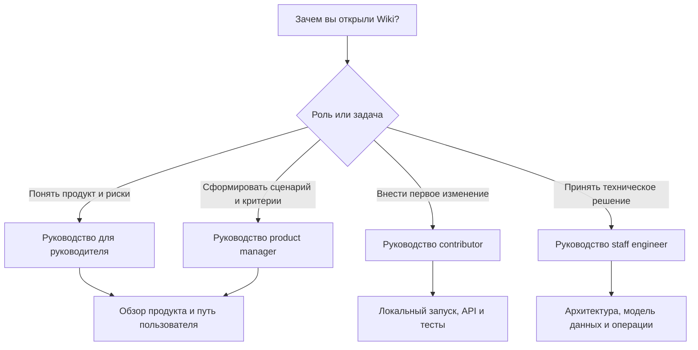

# Онбординг

Эта страница — вход для людей с разными задачами. SplitApp — продукт для учёта общих расходов внутри события; серверная часть хранит правила доступа, чеки, долги и подтверждения платежей. Клиент предлагает действие, а backend определяет личность, проверяет права и фиксирует результат. [Архитектура: доверительные границы](Architecture.md#доверительные-границы)

## Выберите свой маршрут

| Если ваша цель | Начните здесь | Результат маршрута |
|---|---|---|
| Понять ценность, границы и управленческие риски | [Руководство для руководителя](Executive-Guide) | Общая картина способностей, ограничений, рисков данных и контрольных вопросов. |
| Описать изменение продукта, не нарушив финансовые правила | [Руководство для product manager](Product-Manager-Guide) | Сценарий, критерии готовности, данные и границы API без необходимости читать исходный код. |
| Поднять сервис, найти место для изменения и открыть первый PR | [Руководство для contributor](Contributor-Guide) | Локальный запуск, карта слоёв, набор проверок и порядок безопасного изменения контракта. |
| Оценить инварианты, масштабирование и cross-cutting решение | [Руководство для staff engineer](Staff-Engineer-Guide) | Карта доверительных границ, данных, эксплуатации и список архитектурных рисков. |
| Понять, как работают расходы от события до расчёта | [Обзор продукта](Product-Overview) и [Путь пользователя](User-Journey) | Единое объяснение пользовательского потока и того, что меняет баланс. |
| Сопровождать саму документацию | [Поддержка Wiki](Wiki-Maintenance) | Правила источника, проверки и публикации зеркала GitHub Wiki. |

## Общий словарь до начала работы

| Термин | Практический смысл | Где уточнить |
|---|---|---|
| Событие | Изолированное пространство общих расходов и участников. | [Модель данных](Data-Model.md#коллекции-и-владение) |
| Участие | Серверная запись, которая даёт право видеть событие и выполнять операции в нём. | [Аутентификация и безопасность](Authentication-And-Security.md#авторизация-ресурсов) |
| Подтверждённый чек | Расход, который участвует в расчёте баланса; черновик сам по себе баланс не меняет. | [Жизненный цикл чека](Receipt-Lifecycle) |
| План взаиморасчётов | Рекомендованный набор переводов между должниками и кредиторами, а не банковская операция. | [Деньги и взаиморасчёты](Money-And-Settlement) |
| Платёж | Подтверждаемое участниками заявление о переводе вне SplitApp. | [Путь пользователя](User-Journey#последовательность) |

## Непереговорные правила

- Backend — источник истины для membership, прав, балансов и платежей; клиентский интерфейс не может заменять серверную проверку. [Архитектура](Architecture.md#доверительные-границы)
- Все денежные значения новых API и MongoDB-записей хранятся в целых копейках, а не в floating-point. [Модель данных](Data-Model.md#деньги-и-расчёты)
- Закрытое событие не принимает финансовые изменения; это защита целостности, а не ограничение интерфейса. [Путь пользователя](User-Journey#правила-доступа-и-закрытие)
- Splitik может подготовить объяснение или черновик, но не совершает финансовые изменения без явного подтверждения человека. [Помощник Splitik](Splitik-Assistant)

## Связанные страницы

| Страница | Связь |
|---|---|
| [Главная](Home) | Полный каталог Wiki. |
| [Обзор продукта](Product-Overview) | Ценность продукта, роли и границы. |
| [Архитектура](Architecture) | Техническая карта системы и доверительных границ. |
| [Поддержка Wiki](Wiki-Maintenance) | Как сохранять этот маршрут актуальным. |
