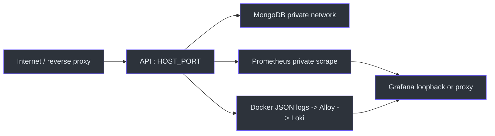
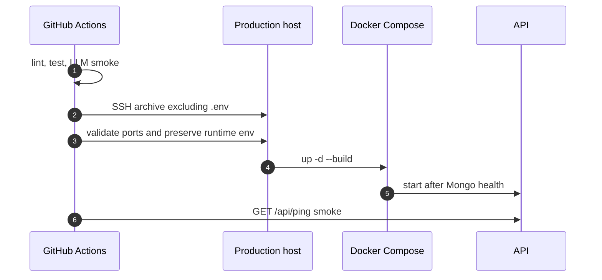

# Операции и деплой

## Runtime и наблюдаемость

Compose запускает API и MongoDB вместе с закрытым стеком Prometheus/Loki/Grafana. Из сервисов наружу публикуются API `${HOST_PORT:-8080}:8000` и Grafana, причём Grafana по умолчанию привязана к loopback. [compose.yaml:3-42](https://github.com/Strongf-bob/SplitAppBackend/blob/main/compose.yaml#L3-L42) [compose.yaml:139-159](https://github.com/Strongf-bob/SplitAppBackend/blob/main/compose.yaml#L139-L159)

| Компонент | Назначение | Эксплуатационный факт | Source |
|---|---|---|---|
| `api` | FastAPI/uvicorn | ждёт health Mongo и имеет `/api/ping` healthcheck | [compose.yaml:4-27](https://github.com/Strongf-bob/SplitAppBackend/blob/main/compose.yaml#L4-L27) |
| `mongo` | persistent data | volume `mongo-data`, private network, healthcheck `db.adminCommand('ping')` | [compose.yaml:29-42](https://github.com/Strongf-bob/SplitAppBackend/blob/main/compose.yaml#L29-L42) |
| Prometheus/Loki/Alloy | metrics и Docker logs | не имеют host ports; Prometheus требует metrics secret | [compose.yaml:44-70](https://github.com/Strongf-bob/SplitAppBackend/blob/main/compose.yaml#L44-L70) [compose.yaml:115-137](https://github.com/Strongf-bob/SplitAppBackend/blob/main/compose.yaml#L115-L137) |
| Grafana | dashboard/query | sign-up выключен; password обязателен | [compose.yaml:139-159](https://github.com/Strongf-bob/SplitAppBackend/blob/main/compose.yaml#L139-L159) |


<!-- Sources: compose.yaml:3-178, app/main.py:111-139, app/core/monitoring.py:13-75 -->

В API request middleware публикует `X-Request-ID`, JSON log и HTTP count/duration; domain/service/DB метрики определены отдельно. [app/main.py:111-139](https://github.com/Strongf-bob/SplitAppBackend/blob/main/app/main.py#L111-L139) [app/core/monitoring.py:13-75](https://github.com/Strongf-bob/SplitAppBackend/blob/main/app/core/monitoring.py#L13-L75) `/api/metrics` не следует проксировать публично: dependency требует отдельный bearer secret и намеренно отвечает 404 при отсутствии. [app/dependencies.py:69-101](https://github.com/Strongf-bob/SplitAppBackend/blob/main/app/dependencies.py#L69-L101)

## Сборка и запуск

Образ строит PWA с Node 22, затем запускает Python 3.12 как непривилегированный `splitapp` user; `web/out` и `docs` попадают в runtime image. [Dockerfile:1-34](https://github.com/Strongf-bob/SplitAppBackend/blob/main/Dockerfile#L1-L34)

```bash
cp .env.docker.example .env
# задать минимум JWT_SECRET, GRAFANA_ADMIN_PASSWORD и METRICS_ACCESS_TOKEN
docker compose up -d --build
docker compose ps
curl -fsS http://127.0.0.1:${HOST_PORT:-8080}/api/ping
docker compose logs --tail=200 api
```

Перед запуском production API задайте Mongo URI/credentials, object-storage keys при использовании receipt images, allowed CORS origins и runtime secrets в server-side `.env`; `.env` не включается в CI deploy archive. [app/core/db.py:32-94](https://github.com/Strongf-bob/SplitAppBackend/blob/main/app/core/db.py#L32-L94) [app/core/s3.py:19-43](https://github.com/Strongf-bob/SplitAppBackend/blob/main/app/core/s3.py#L19-L43) [ci.yml:219-229](https://github.com/Strongf-bob/SplitAppBackend/blob/main/.github/workflows/ci.yml#L219-L229)

## Развёртывание

Deploy job запускается только для push в `main` после test и LLM smoke. Он валидирует secrets, передаёт checkout по SSH, сохраняет server-side `.env`, делает port preflight, поднимает Compose и ждёт `/api/ping`. [ci.yml:158-217](https://github.com/Strongf-bob/SplitAppBackend/blob/main/.github/workflows/ci.yml#L158-L217) [ci.yml:263-308](https://github.com/Strongf-bob/SplitAppBackend/blob/main/.github/workflows/ci.yml#L263-L308)


<!-- Sources: .github/workflows/ci.yml:158-308, compose.yaml:3-42 -->

## Backup и восстановление

`mongo-data`, Prometheus, Loki и Grafana — named volumes; критичные пользовательские данные находятся в MongoDB, поэтому backup должен быть отдельной регулярной процедурой (volume snapshot либо `mongodump`) и восстановление следует репетировать вне production. [compose.yaml:180-190](https://github.com/Strongf-bob/SplitAppBackend/blob/main/compose.yaml#L180-L190) Перед recovery сначала зафиксируйте request IDs, `docker compose ps` и последние API logs; unexpected exceptions уже содержат request context. [app/main.py:91-139](https://github.com/Strongf-bob/SplitAppBackend/blob/main/app/main.py#L91-L139)

## Связанные страницы

| Page | Relationship |
|---|---|
| [Архитектура](Architecture.md#наблюдаемость) | Объясняет instrumentation request path. |
| [Аутентификация и безопасность](Authentication-And-Security.md#refresh-токены-и-секреты) | Runtime secret boundaries. |
| [Модель данных](Data-Model.md#индексы-как-контракт) | MongoDB state, indexes и TTL. |
| [Тесты и CI](Testing-And-CI.md#github-actions) | Полный CI gate перед deploy. |
