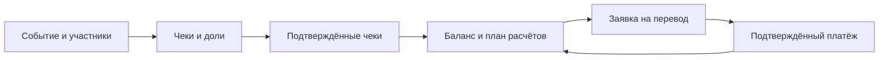

# SplitApp: что это за продукт

SplitApp помогает участникам одного события договориться о расходах: зафиксировать чек, распределить позиции, увидеть итоговые долги и провести подтверждённые переводы. Это **не платёжный сервис**: приложение хранит договорённости и подтверждения участников, а перевод денег происходит вне него.

## Для кого и какую задачу решает

| Роль | Что делает | Ограничение | Подтверждение в коде |
|---|---|---|---|
| Создатель события | Создаёт событие, приглашает и может управлять участниками | Доступ проверяется в сервисах события | [маршруты события](https://github.com/Strongf-bob/SplitAppBackend/blob/main/app/routers/events.py#L12-L148) |
| Участник | Добавляет чеки по политике события, видит общий баланс | Вход в данные события требует членства | [проверка доступа к балансу](https://github.com/Strongf-bob/SplitAppBackend/blob/main/app/services/balances.py#L151-L172) |
| Плательщик чека | Указывает, кто оплатил, и участвует в подтверждении | Не может назначить долю человеку вне события | [проверка участников и долей](https://github.com/Strongf-bob/SplitAppBackend/blob/main/app/services/receipts.py#L49-L73) |
| Кредитор и должник | Ведут заявку на перевод и подтверждают факт оплаты | Заявку создаёт только кредитор, «оплачено» отмечает только должник | [правила заявки](https://github.com/Strongf-bob/SplitAppBackend/blob/main/app/services/payments.py#L304-L362), [отметка оплаты](https://github.com/Strongf-bob/SplitAppBackend/blob/main/app/services/payments.py#L514-L557) |
| Splitik | Объясняет и готовит черновики | Не меняет денежные данные без явного подтверждения | [защитные правила](https://github.com/Strongf-bob/SplitAppBackend/blob/main/app/services/splitik_guardrails.py#L119-L152) |

## Граница продукта

| В продукте | Не является обещанием продукта |
|---|---|
| Учёт чеков, долей, подтверждённых платежей и балансов | Автоматическое списание или перевод денег |
| Предпросмотр и план взаиморасчётов | Гарантия, что внешний банковский перевод состоялся |
| Черновики от помощника и ручное подтверждение | Самостоятельное изменение чеков, долгов или чужих платежей помощником |

<!-- Sources: app/routers/events.py:151-235, app/services/balances.py:32-48, app/services/balances.py:151-172 -->

Подтверждённый чек и подтверждённый платёж — источники баланса; черновики и ожидающие подтверждения записи сами по себе его не меняют. [Источник данных баланса](https://github.com/Strongf-bob/SplitAppBackend/blob/main/app/services/balances.py#L32-L48).

## Ключевые поверхности API

| Задача | Маршрут | Источник |
|---|---|---|
| События и приглашения | `POST/GET /api/events`, приглашения события | [events.py](https://github.com/Strongf-bob/SplitAppBackend/blob/main/app/routers/events.py#L12-L148) |
| Баланс и план | `GET /api/events/{id}/balances`, `.../settlement-preview`, планы | [events.py](https://github.com/Strongf-bob/SplitAppBackend/blob/main/app/routers/events.py#L151-L245) |
| Чеки | `POST /api/events/{id}/receipts`, подтверждение и исправление | [receipts.py](https://github.com/Strongf-bob/SplitAppBackend/blob/main/app/routers/receipts.py#L22-L176) |
| Деньги | платежи и заявки на платёж | [payments.py](https://github.com/Strongf-bob/SplitAppBackend/blob/main/app/routers/payments.py#L12-L157) |
| Споры | создание и разрешение спора | [disputes.py](https://github.com/Strongf-bob/SplitAppBackend/blob/main/app/routers/disputes.py#L12-L39) |

## Связанные страницы

| Страница | Зачем читать |
|---|---|
| [Путь пользователя](User-Journey) | Последовательность действий и доступов |
| [Деньги и взаиморасчёты](Money-And-Settlement) | Как формируются долги и платежи |
| [Жизненный цикл чека](Receipt-Lifecycle) | Статусы чека, доли и изображения |
| [Помощник Splitik](Splitik-Assistant) | Что может и чего не может помощник |
