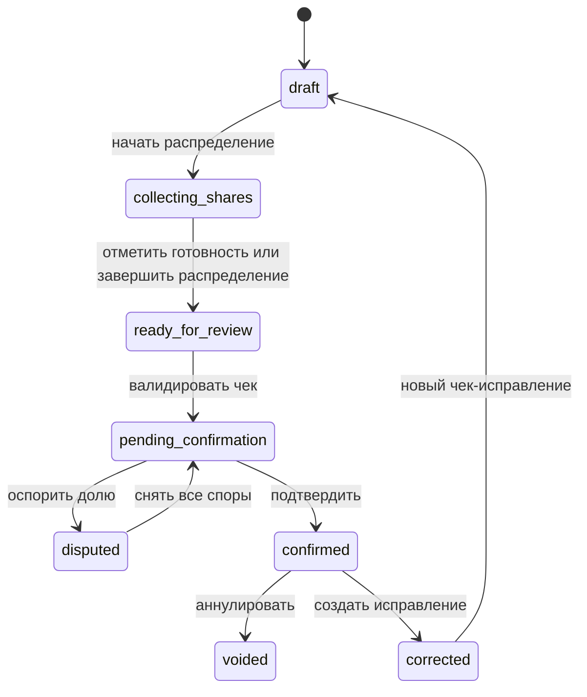

# Жизненный цикл чека

Чек — это расход в пределах одного события: у него есть плательщик, позиции, доли и статус. Пока чек не подтверждён, он не участвует в балансе; после подтверждения его нельзя просто удалить — его нужно аннулировать или создать исправление. [Источники баланса](https://github.com/Strongf-bob/SplitAppBackend/blob/main/app/services/balances.py#L32-L48), [правило удаления](https://github.com/Strongf-bob/SplitAppBackend/blob/main/app/services/receipts.py#L549-L569).

## Статусы и версии

<!-- Sources: app/services/receipts.py:307-343, app/services/receipts.py:372-450, app/services/receipts.py:572-678, app/services/receipts.py:792-1000 -->

| Состояние/действие | Значение | Правило | Источник |
|---|---|---|---|
| `draft` | Черновой чек | Можно запустить сессию распределения | [start allocation](https://github.com/Strongf-bob/SplitAppBackend/blob/main/app/services/receipts.py#L792-L831) |
| `collecting_shares` | Участники выбирают позиции | Заявка относится к конкретной позиции и участнику | [claim](https://github.com/Strongf-bob/SplitAppBackend/blob/main/app/services/receipts.py#L841-L883) |
| `ready_for_review` | Состав и доли готовы к проверке | `mark ready` только отмечает сессию готовой; `finalize` завершает сессию, строит равные доли выбранных участников и также оставляет чек в этом статусе | [ready](https://github.com/Strongf-bob/SplitAppBackend/blob/main/app/services/receipts.py#L914-L935), [finalize](https://github.com/Strongf-bob/SplitAppBackend/blob/main/app/services/receipts.py#L939-L1000) |
| `pending_confirmation` | Чек прошёл валидацию и ожидает решения по долям | Валидацию выполняет создатель или плательщик; создаются проверки долей и окно проверки | [validate](https://github.com/Strongf-bob/SplitAppBackend/blob/main/app/services/receipts.py#L307-L343) |
| `disputed` | Хотя бы одна доля оспорена | Подтверждение заблокировано; после снятия всех споров статус возвращается в `pending_confirmation` | [accept](https://github.com/Strongf-bob/SplitAppBackend/blob/main/app/services/receipts.py#L372-L407), [dispute](https://github.com/Strongf-bob/SplitAppBackend/blob/main/app/services/receipts.py#L410-L450) |
| `pending_confirmation` → `confirmed` | Расход начинает влиять на баланс | Нужны принятые проверки долей и разрешённый финализатор | [confirm](https://github.com/Strongf-bob/SplitAppBackend/blob/main/app/services/receipts.py#L572-L607) |
| `voided` / `corrected` | Подтверждённый чек исключён из будущего расчёта или заменён новым черновиком | Аннулировать или исправить может создатель либо плательщик | [void](https://github.com/Strongf-bob/SplitAppBackend/blob/main/app/services/receipts.py#L646-L678), [исправление](https://github.com/Strongf-bob/SplitAppBackend/blob/main/app/services/receipts.py#L681-L757) |

Версия чека увеличивается при обновлении, подтверждении и аннулировании; это позволяет клиенту увидеть смену состояния. [Нормализация версии](https://github.com/Strongf-bob/SplitAppBackend/blob/main/app/services/receipts.py#L139-L166), [обновление](https://github.com/Strongf-bob/SplitAppBackend/blob/main/app/services/receipts.py#L519-L525).

## Позиции, доли, проверки и AI

| Объект | Как устроен | Источник |
|---|---|---|
| Позиция чека | Имеет цену в копейках и ссылки на доли | [создание позиций](https://github.com/Strongf-bob/SplitAppBackend/blob/main/app/services/receipts.py#L76-L110) |
| Доля | Каждый участник доли должен быть в событии; сумма долей позиции строго равна 1 | [валидация](https://github.com/Strongf-bob/SplitAppBackend/blob/main/app/services/receipts.py#L49-L73) |
| Проверка долей | Для затронутых участников создаются проверки; спор блокирует подтверждение | [reviews](https://github.com/Strongf-bob/SplitAppBackend/blob/main/app/services/receipts.py#L180-L223) |
| AI-черновик | Отдельный маршрут возвращает черновик, а не подтверждённый расход | [маршрут AI-черновика](https://github.com/Strongf-bob/SplitAppBackend/blob/main/app/routers/receipts.py#L50-L62) |

## Изображение чека

| Операция | Что доступно | Источник |
|---|---|---|
| Загрузить | JPEG через `file` или `image`; обработка передаёт тело и content type сервису | [upload route](https://github.com/Strongf-bob/SplitAppBackend/blob/main/app/routers/receipts.py#L252-L280) |
| Получить | Выдаётся pre-signed URL, а не постоянная публичная ссылка | [URL route](https://github.com/Strongf-bob/SplitAppBackend/blob/main/app/routers/receipts.py#L294-L304) |
| Заменить/удалить | Есть отдельная операция удаления изображения | [delete route](https://github.com/Strongf-bob/SplitAppBackend/blob/main/app/routers/receipts.py#L283-L291) |

## Связанные страницы

| Страница | Связь |
|---|---|
| [Путь пользователя](User-Journey) | Где чек появляется в сценарии |
| [Деньги и взаиморасчёты](Money-And-Settlement) | Как подтверждённый чек образует долг |
| [Помощник Splitik](Splitik-Assistant) | Черновики помощника не заменяют подтверждение |
| [Обзор продукта](Product-Overview) | Роли плательщика и участников |
