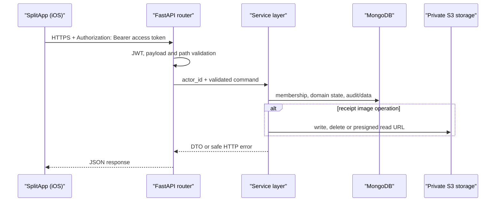

# Интеграция SplitApp и SplitAppBackend

Эта страница описывает границу между нативным iOS-приложением
[Strongf-bob/SplitApp](https://github.com/Strongf-bob/SplitApp) и этим backend-репозиторием.
Она описывает правила для текущего iOS-клиента и других потребителей API: сервер определяет
личность, права и финансовую истину, а клиент бережно отображает результат и повторяет только
допустимые запросы.

## Граница ответственности

| Область | iOS-клиент | SplitAppBackend |
| --- | --- | --- |
| Экран и UX | Навигация, формы, локальные loading/error states, доступность и локальный кэш. | Не управляет экраном и не полагается на его проверки. |
| Сеть и сессия | Передаёт Bearer access token, безопасно хранит refresh token, один раз обновляет сессию после `401`. | Проверяет JWT и извлекает actor; login/refresh выпускают и ротируют токены. |
| Данные | Декодирует DTO и обновляет кэш только по ответам API. | Валидирует payload, проверяет membership/роль и является источником правды для данных. |
| Деньги и доступ | Показывает суммы в UI без `Float`-расчётов и не решает, кому разрешена операция. | Хранит суммы в копейках, рассчитывает балансы, применяет бизнес-правила и authorisation. |
| Фото чеков | Загружает multipart-файл и использует временный URL для чтения. | Валидирует и хранит объект в private S3-compatible storage; выдаёт presigned URL и удаляет объект при замене/удалении. |

В частности, локальный кэш membership, выбранного события или баланса может быть устаревшим и
не является разрешением на запрос. Решение о доступе остаётся на сервере рядом с операцией.

## Путь запроса

HTTP layer и auth dependency можно проследить в
[dependencies.py](https://github.com/Strongf-bob/SplitAppBackend/blob/main/app/dependencies.py#L86-L148).
Маршруты передают уже проверенный actor в services: [events](https://github.com/Strongf-bob/SplitAppBackend/blob/main/app/routers/events.py#L12-L245),
[receipts](https://github.com/Strongf-bob/SplitAppBackend/blob/main/app/routers/receipts.py#L22-L298) и
[payments](https://github.com/Strongf-bob/SplitAppBackend/blob/main/app/routers/payments.py#L12-L171).

## Проверенные точки iOS-клиента

Ниже перечислены исходники, существование которых проверено в ветке `main` репозитория
`Strongf-bob/SplitApp`; ссылки ведут на исходный код, а не на копию контракта.

- [APIClient.swift](https://github.com/Strongf-bob/SplitApp/blob/main/SplitApp/Core/Network/APIClient.swift) — общий transport.
- [EventEndpoints.swift](https://github.com/Strongf-bob/SplitApp/blob/main/SplitApp/Data/Network/Endpoints/EventEndpoints.swift) — события, участники и balances.
- [ReceiptEndpoints.swift](https://github.com/Strongf-bob/SplitApp/blob/main/SplitApp/Data/Network/Endpoints/ReceiptEndpoints.swift) — чеки и фото.
- [PaymentEndpoints.swift](https://github.com/Strongf-bob/SplitApp/blob/main/SplitApp/Data/Network/Endpoints/PaymentEndpoints.swift) — платежи и payment requests.
- [BalanceEndpoints.swift](https://github.com/Strongf-bob/SplitApp/blob/main/SplitApp/Data/Network/Endpoints/BalanceEndpoints.swift) — представление долгов.
- [UserEndpoints.swift](https://github.com/Strongf-bob/SplitApp/blob/main/SplitApp/Data/Network/Endpoints/UserEndpoints.swift) — профиль и пользователи.

## Карта пользовательских сценариев

| Сценарий в iOS | Endpoint-группа | Серверная гарантия |
| --- | --- | --- |
| Войти и восстановить сессию | `POST /api/login`, `POST /api/refresh` | Токен проверяется/ротируется сервером; login и refresh ограничены rate limit. |
| Найти пользователя, открыть свой профиль | `/api/users`, `/api/users/search`, `/api/users/me` | Клиент видит только разрешённые сервером данные; списки пагинируются. |
| Создать событие, пригласить и управлять участниками | `/api/events`, `/api/events/{id}/participants`, `/api/invites/*` | Membership и creator-права проверяются в сервисе. |
| Внести и распределить чек | `/api/events/{id}/receipts`, `/api/receipts/*`, `/api/allocation-sessions/*` | Payload, состояние события и права участника валидируются до записи. |
| Прикрепить или прочитать фото | `/api/receipts/{id}/image`, `/api/receipts/{id}/image/presigned-url` | Объект не становится публичным URL; доступ проверяется до выдачи временной ссылки. |
| Посмотреть долги и договориться о расчёте | `/api/events/{id}/balances*`, `/api/events/{id}/settlement-*` | Балансы и план вычисляет backend; plan не означает совершённый платёж. |
| Зафиксировать перевод | `/api/events/{id}/payments`, `/api/events/{id}/payment-requests`, `/api/payments/*` | Только подтверждённый платёж влияет на финальное состояние; стороны операции проверяются сервером. |

Полный набор путей и схем остаётся в [OpenAPI-контракте](https://github.com/Strongf-bob/SplitAppBackend/blob/main/openapi.yaml) и
[Руководстве по API](API-Guide).

## Совместимая поставка изменения контракта

Для изменения, которое затрагивает iOS, порядок должен быть таким:

1. Сначала согласовать семантику: actor, membership, деньги, ошибки, пагинацию и необходимость идемпотентности.
2. Добавить на backend обратносуместимый контракт: optional поле с default, новый endpoint или новая версия поведения; обновить schemas, `openapi.yaml`, tests и wiki.
3. Развернуть backend и убедиться, что старый iOS-клиент продолжает работать.
4. Выпустить iOS-клиент, использующий новое поле/endpoint, с обработкой отсутствующего optional поля и известных HTTP-ошибок.
5. Только после принятия клиентской версии удалить старое поле или endpoint отдельным явно breaking change с migration notice.

Нельзя сначала потребовать от уже выпущенного клиента новый обязательный request field, изменить
смысл существующей суммы или заменить форму пагинации. Для money-команд клиент также обязан
сохранять один `Idempotency-Key` на пользовательское намерение и повторять именно его при
сетевом retry; подробности — в [API guide](API-Guide).

## Связанные страницы

- [Руководство по API](API-Guide)
- [Аутентификация и безопасность](Authentication-And-Security)
- [Деньги и взаиморасчёты](Money-And-Settlement)
- [Архитектура](Architecture)
