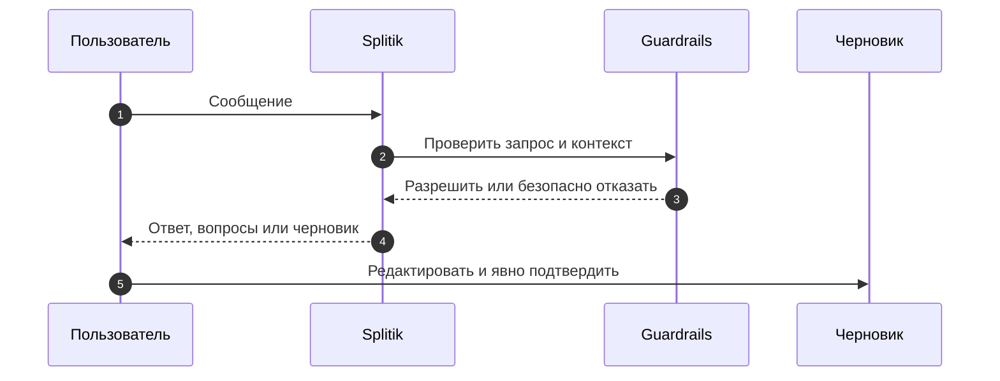

# Помощник Splitik

Splitik — разговорный помощник внутри SplitApp. Он помогает объяснить данные и подготовить черновик события или чека, но не является самостоятельным исполнителем финансовых действий. Изменение возникает только через черновик и явное действие пользователя. [Защитное сообщение](https://github.com/Strongf-bob/SplitAppBackend/blob/main/app/services/splitik_guardrails.py#L119-L135).

## Возможности и границы

| Область | Что доступно | Что запрещено | Источник |
|---|---|---|---|
| Контекст | Сводка пользователя, события, чека или участника в зависимости от режима | Нет доступа к личным тратам другого человека вне общего события | [режимы](https://github.com/Strongf-bob/SplitAppBackend/blob/main/app/services/splitik.py#L112-L139), [guardrails](https://github.com/Strongf-bob/SplitAppBackend/blob/main/app/services/splitik_guardrails.py#L97-L116) |
| Черновики | Создание события и добавление чека в поддерживаемом режиме | Нельзя незаметно менять уже существующее денежное состояние | [capabilities](https://github.com/Strongf-bob/SplitAppBackend/blob/main/app/services/splitik.py#L112-L125), [forbidden operations](https://github.com/Strongf-bob/SplitAppBackend/blob/main/app/services/splitik_guardrails.py#L138-L152) |
| Сообщения | Текст и ограниченное число вложений | Нельзя отправлять секреты; чувствительные фрагменты маскируются | [sanitization](https://github.com/Strongf-bob/SplitAppBackend/blob/main/app/services/splitik_guardrails.py#L75-L89), [лимиты](https://github.com/Strongf-bob/SplitAppBackend/blob/main/app/services/splitik.py#L1245-L1274) |

<!-- Sources: app/routers/splitik.py:35-102, app/services/splitik.py:1226-1324, app/services/splitik_guardrails.py:97-175 -->

## Черновик — точка контроля пользователя

| Шаг | Результат | Источник |
|---|---|---|
| Отправить сообщение | Сервер применяет идемпотентность, лимиты и проверку пользовательского текста | [messages route](https://github.com/Strongf-bob/SplitAppBackend/blob/main/app/routers/splitik.py#L35-L57), [обработка](https://github.com/Strongf-bob/SplitAppBackend/blob/main/app/services/splitik.py#L1226-L1275) |
| Прочитать черновик | Пользователь получает только свой черновик через сервис инструментов | [get draft](https://github.com/Strongf-bob/SplitAppBackend/blob/main/app/services/splitik.py#L1571-L1573) |
| Отредактировать | Изменения передаются явным `PATCH` | [update route](https://github.com/Strongf-bob/SplitAppBackend/blob/main/app/routers/splitik.py#L86-L93), [service](https://github.com/Strongf-bob/SplitAppBackend/blob/main/app/services/splitik.py#L1575-L1586) |
| Зафиксировать | Пользователь явно вызывает commit черновика | [commit route](https://github.com/Strongf-bob/SplitAppBackend/blob/main/app/routers/splitik.py#L96-L102), [service](https://github.com/Strongf-bob/SplitAppBackend/blob/main/app/services/splitik.py#L1589-L1590) |

Не следует трактовать ответ Splitik как подтверждение платежа или чека: эти операции имеют собственные защищённые маршруты и требуют действий сторон. [Подтверждение чека](https://github.com/Strongf-bob/SplitAppBackend/blob/main/app/routers/receipts.py#L83-L101), [подтверждение платежа](https://github.com/Strongf-bob/SplitAppBackend/blob/main/app/routers/payments.py#L118-L157).

## Связанные страницы

| Страница | Связь |
|---|---|
| [Обзор продукта](Product-Overview) | Общая граница ответственности продукта |
| [Путь пользователя](User-Journey) | Место помощника в сценарии участника |
| [Жизненный цикл чека](Receipt-Lifecycle) | Черновик расхода и явное подтверждение |
| [Деньги и взаиморасчёты](Money-And-Settlement) | Почему помощник не управляет переводами |
