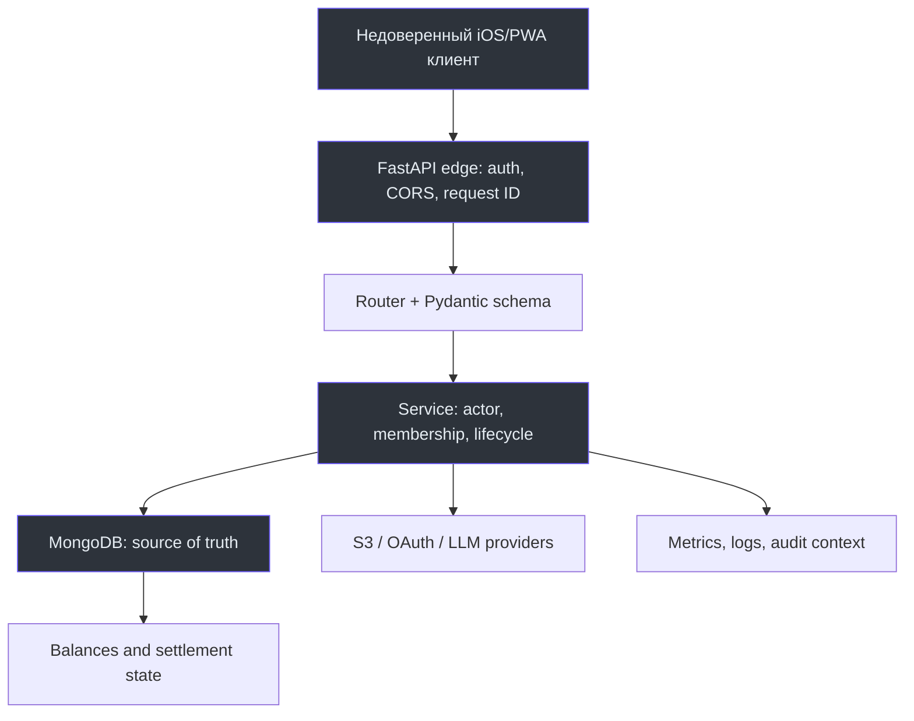

# Руководство staff engineer

Этот маршрут нужен для решений, которые пересекают доменную модель, контракт, безопасность и эксплуатацию. Прежде чем выбирать технологию, зафиксируйте сохраняемый инвариант: кто владеет ресурсом, какие состояния допустимы и где backend должен отвергнуть действие.

## Карта архитектурного решения


<!-- Sources: app/main.py:43-139, app/services/access.py:14-69, app/core/db.py:67-106 -->

Ключевое правило: финансовая и access truth принадлежит backend. Слой клиента может улучшить сценарий, но не может авторизовать операцию. Application wiring задаёт общую bearer dependency и router registration в [app/main.py:223-248](https://github.com/Strongf-bob/SplitAppBackend/blob/main/app/main.py#L223-L248), а service layer выполняет membership, creator и open-event checks в [app/services/access.py:14-69](https://github.com/Strongf-bob/SplitAppBackend/blob/main/app/services/access.py#L14-L69).

## Инварианты, которые должны пережить изменение

| Инвариант | Значение для решения | Основной source |
|---|---|---|
| Actor server-owned | Идентичность берётся из проверенного access JWT, не из payload. | [dependencies.py:106-148](https://github.com/Strongf-bob/SplitAppBackend/blob/main/app/dependencies.py#L106-L148) |
| Event-scoped access | Membership отделяет данные одного события от другого; creator имеет отдельные права управления. | [access.py:21-69](https://github.com/Strongf-bob/SplitAppBackend/blob/main/app/services/access.py#L21-L69) |
| Финансовая целостность | Баланс строится из подтверждённых чеков и подтверждённых платежей; деньги — integer kopecks. | [balances.py:32-48](https://github.com/Strongf-bob/SplitAppBackend/blob/main/app/services/balances.py#L32-L48) |
| Lifecycle first | Soft-deleted record не возвращается, closed event не принимает финансовый write. | [access.py:14-18](https://github.com/Strongf-bob/SplitAppBackend/blob/main/app/services/access.py#L14-L18), [access.py:56-61](https://github.com/Strongf-bob/SplitAppBackend/blob/main/app/services/access.py#L56-L61) |
| Подтверждение человеком | Ассистент создаёт только draft; write action требует явного confirm. | [splitik_tools.py:256-291](https://github.com/Strongf-bob/SplitAppBackend/blob/main/app/services/splitik_tools.py#L256-L291) |
| Операционная наблюдаемость | Ошибка клиента generic, а диагностика коррелируется request ID в logs и metrics. | [app/main.py:91-139](https://github.com/Strongf-bob/SplitAppBackend/blob/main/app/main.py#L91-L139) |

## Как исследовать перед реализацией

1. Начните с бизнес-сценария в [Пути пользователя](User-Journey), [Деньгах и взаиморасчётах](Money-And-Settlement) или [Жизненном цикле чека](Receipt-Lifecycle), затем проследите HTTP path в [Руководстве по API](API-Guide).
2. Постройте read/write graph: router → schema → service → collection/index → event/receipt/payment projection. Карта relations и индексов находится в [Data model](Data-Model).
3. Определите consistency boundary. Для финансовой записи это event и подтверждённое состояние; для identity-операции это actor + scope + idempotency key. [Индексы idempotency](https://github.com/Strongf-bob/SplitAppBackend/blob/main/app/services/indexes.py#L58-L67)
4. Отделите server-owned факт от внешнего утверждения: перевод денег происходит вне продукта, поэтому приложение фиксирует только согласованную заявку и подтверждение, а не банковскую истину. [Обзор продукта](Product-Overview#граница-продукта)
5. Сформируйте rollout и observability plan: health, request ID, метрики, Docker Compose boundaries, rollback/backup. [Операции и деплой](Operations-And-Deployment)

## Архитектурные красные флаги

| Наблюдение | Риск | Требуемая реакция |
|---|---|---|
| Authorization только в router/UI | Новый путь к service или фоновая задача обходит проверку. | Поместить проверку actor/resource близко к service operation. |
| New list без limit/offset | Неограниченное чтение, нагрузка и случайная утечка данных. | Добавить pagination и event/owner filter до масштабного клиентского использования. |
| Десятичные float для денег | Недетерминированные суммы и расхождение расчётов. | Использовать integer kopecks на contract и persistence boundary. |
| Hard delete security-sensitive state | Потеря расследуемости и возможность resurrection багов. | Применить soft delete или документировать исключение и тест. |
| Новый AI write-path без confirm | Модель получает возможность менять чужие деньги или доступы. | Сохранить draft-first и server-side confirmation gate. |
| Public observability endpoint | Метрики и логи становятся источником операционных/персональных деталей. | Сохранить отдельный metrics secret и закрытый сетевой контур. |

## Контрольный список design-review

```text
[ ] Actor and resource ownership are explicit.
[ ] API schema, runtime OpenAPI, openapi.yaml, tests and Wiki change together.
[ ] New persistence state has indexes, TTL or retention semantics where needed.
[ ] Lifecycle, idempotency and retry behavior are explicit.
[ ] Error message, request context and metrics preserve safe observability.
[ ] Compose/CI/deploy impact and rollback path are reviewed.
```

CI запускает lint, tests и дополнительные push/main gates; точная последовательность и deploy boundary описаны в [Testing and CI](Testing-And-CI) и [Operations and deployment](Operations-And-Deployment#deploy).

## Связанные страницы

| Page | Relationship |
|---|---|
| [Архитектура](Architecture) | Доверительные границы и основные пути запроса. |
| [Модель данных](Data-Model) | Collections, ownership, lifecycle и indexes. |
| [Аутентификация и безопасность](Authentication-And-Security) | Identity, tokens, CORS и error boundaries. |
| [Операции и деплой](Operations-And-Deployment) | Runtime, observability, backup и deploy. |
| [Руководство contributor](Contributor-Guide) | Практика ограниченного изменения и проверок. |
