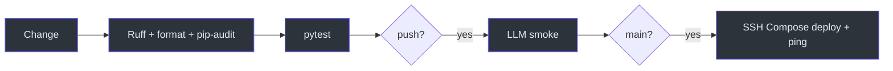
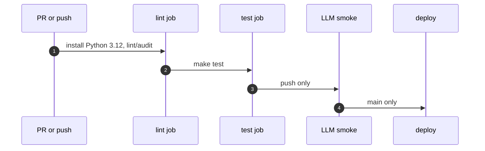

# Тесты и CI

## Пирамида проверок

Проверки существуют, чтобы backend contract не расходился с правилами доступа и production assembly: быстрые статические проверки выявляют стиль и зависимости, pytest фиксирует behaviour, а push-only LLM smoke и deploy проверяют интеграционные границы. Commands определены как Make targets и выбирают `.venv`, если он есть. [Makefile:13-44](https://github.com/Strongf-bob/SplitAppBackend/blob/main/Makefile#L13-L44)

| Gate | Команда / trigger | Что доказывает | Source |
|---|---|---|---|
| Unit/integration tests | `make test` | pytest suite с backend behaviour | [Makefile:18-23](https://github.com/Strongf-bob/SplitAppBackend/blob/main/Makefile#L18-L23) |
| Lint | `make lint` | Ruff static checks | [Makefile:25-30](https://github.com/Strongf-bob/SplitAppBackend/blob/main/Makefile#L25-L30) |
| Format | `make format-check` | deterministic Ruff formatting | [Makefile:32-37](https://github.com/Strongf-bob/SplitAppBackend/blob/main/Makefile#L32-L37) |
| Dependency audit | `make security-audit` | `pip_audit` requirements scan | [Makefile:39-44](https://github.com/Strongf-bob/SplitAppBackend/blob/main/Makefile#L39-L44) |


<!-- Sources: .github/workflows/ci.yml:13-67, .github/workflows/ci.yml:158-308, Makefile:18-44 -->

## Локальный baseline

```bash
make setup       # первый запуск
make test
make lint
make format-check
make security-audit
git diff --check
```

Для изменений API также сверяйте generated `app.openapi()` с `openapi.yaml`, а для docs — существование файлов, relative links и Mermaid syntax. API router registration находится в одном месте, поэтому добавленный router должен быть включён в `create_app`. [app/main.py:223-248](https://github.com/Strongf-bob/SplitAppBackend/blob/main/app/main.py#L223-L248)

## Автоматические проверки GitHub Actions

Workflow запускается на PR и push в `main`/`strongf/**`; `test` зависит от `lint`. [ci.yml:1-61](https://github.com/Strongf-bob/SplitAppBackend/blob/main/.github/workflows/ci.yml#L1-L61) На push, LLM job требует provider credentials, делает три попытки для ролей primary/fast_chat/intent и исполняет smoke pytest. [ci.yml:63-156](https://github.com/Strongf-bob/SplitAppBackend/blob/main/.github/workflows/ci.yml#L63-L156) Production deploy является gated только для `refs/heads/main`. [ci.yml:158-165](https://github.com/Strongf-bob/SplitAppBackend/blob/main/.github/workflows/ci.yml#L158-L165)


<!-- Sources: .github/workflows/ci.yml:13-165 -->

## Регрессионные контракты

| Изменение | Минимальный regression focus | Evidence |
|---|---|---|
| JWT/auth exceptions | allow-list, expired/invalid JWT, refresh rotation, metrics token | [app/dependencies.py:86-137](https://github.com/Strongf-bob/SplitAppBackend/blob/main/app/dependencies.py#L86-L137) |
| Event/financial flow | actor membership, creator-only action, closed-event rejection | [app/services/access.py:33-69](https://github.com/Strongf-bob/SplitAppBackend/blob/main/app/services/access.py#L33-L69) |
| Persistence | unique and TTL indexes; soft-deleted resource invisible | [app/services/indexes.py:4-67](https://github.com/Strongf-bob/SplitAppBackend/blob/main/app/services/indexes.py#L4-L67) |
| Runtime/observability | `/api/ping`, request ID, generic 500, protected metrics | [app/main.py:91-139](https://github.com/Strongf-bob/SplitAppBackend/blob/main/app/main.py#L91-L139) |

## Связанные страницы

| Page | Relationship |
|---|---|
| [Архитектура](Architecture.md#ключевые-пути) | Contract paths, которые покрывают tests. |
| [Аутентификация и безопасность](Authentication-And-Security.md#авторизация-ресурсов) | Security cases для regression tests. |
| [Операции и деплой](Operations-And-Deployment.md#deploy) | CI gates и production smoke. |
| [Руководство по API](API-Guide.md) | API-контракт, который надо сохранять синхронным. |
