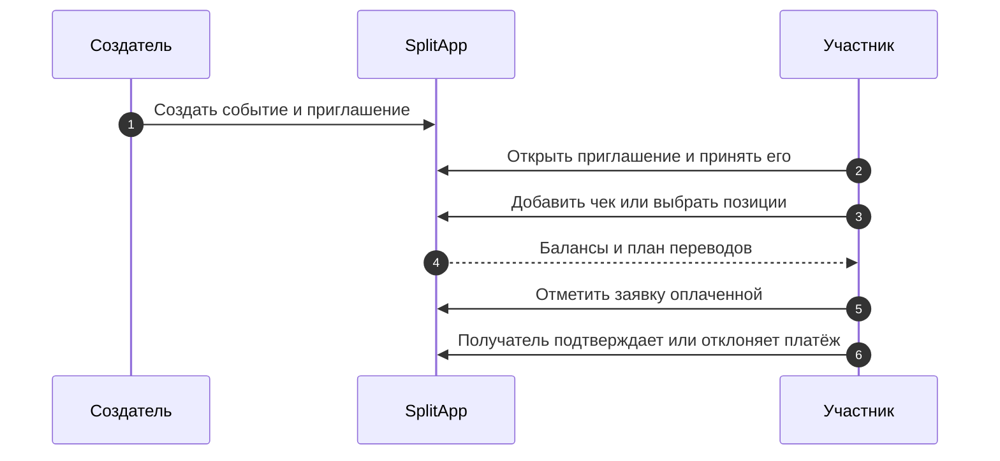

# Путь пользователя

Путь строится вокруг общего события: пользователь получает доступ как участник, фиксирует расходы вместе с другими участниками, затем согласует и закрывает расчёты. Все показанные маршруты получают идентификатор текущего пользователя из аутентификации, а не из тела запроса. [Пример маршрута](https://github.com/Strongf-bob/SplitAppBackend/blob/main/app/routers/events.py#L12-L28).

## Последовательность

<!-- Sources: app/routers/events.py:96-134, app/routers/receipts.py:22-239, app/routers/payments.py:70-145 -->

| Шаг | Пользовательский результат | Кто вправе действовать | Источник |
|---|---|---|---|
| Создать событие | Возникает общее пространство расходов | Аутентифицированный пользователь | [создание события](https://github.com/Strongf-bob/SplitAppBackend/blob/main/app/routers/events.py#L12-L18) |
| Вступить по приглашению | Пользователь становится участником после принятия | Получатель приглашения | [preview/accept/decline](https://github.com/Strongf-bob/SplitAppBackend/blob/main/app/routers/events.py#L110-L134) |
| Добавить чек | Расход и доли записаны для события | Политика может разрешать всем или только создателю | [политика создания](https://github.com/Strongf-bob/SplitAppBackend/blob/main/app/services/receipts.py#L113-L117) |
| Распределить позиции | Участники заявляют позиции чернового чека | Каждый участник только в своём событии | [сессия распределения](https://github.com/Strongf-bob/SplitAppBackend/blob/main/app/services/receipts.py#L792-L883) |
| Подтвердить чек | Чек начинает влиять на баланс | По политике: плательщик или создатель | [правила подтверждения](https://github.com/Strongf-bob/SplitAppBackend/blob/main/app/services/receipts.py#L119-L131), [подтверждение](https://github.com/Strongf-bob/SplitAppBackend/blob/main/app/services/receipts.py#L572-L607) |
| Рассчитаться | Заявка становится ожидающим подтверждения платежом, затем подтверждается или отклоняется | Только должник отмечает оплату; только получатель платежа подтверждает или отклоняет её | [отметка оплаты](https://github.com/Strongf-bob/SplitAppBackend/blob/main/app/services/payments.py#L514-L557), [подтверждение](https://github.com/Strongf-bob/SplitAppBackend/blob/main/app/services/payments.py#L167-L210), [отклонение](https://github.com/Strongf-bob/SplitAppBackend/blob/main/app/services/payments.py#L213-L252) |

## Правила доступа и закрытие

| Правило | Практический смысл | Источник |
|---|---|---|
| Доступ к балансу проверяется до расчёта | Нельзя получить долг чужого события | [balances.py](https://github.com/Strongf-bob/SplitAppBackend/blob/main/app/services/balances.py#L151-L172) |
| Получатель заявки — текущий пользователь | Нельзя выставить заявку от имени другого участника | [payments.py](https://github.com/Strongf-bob/SplitAppBackend/blob/main/app/services/payments.py#L310-L325) |
| Создатель/плательщик может аннулировать подтверждённый чек | История меняется явной операцией, а не удалением | [void](https://github.com/Strongf-bob/SplitAppBackend/blob/main/app/services/receipts.py#L646-L678) |
| Только создатель закрывает или вновь открывает событие | Статус `is_closed` меняется через обновление события и записывается в аудит | [update event](https://github.com/Strongf-bob/SplitAppBackend/blob/main/app/services/events.py#L362-L409) |
| Закрытое событие блокирует финансовые изменения | Сервисы чеков и платежей вызывают общую проверку открытого события | [assert event open](https://github.com/Strongf-bob/SplitAppBackend/blob/main/app/services/access.py#L56-L61), [платёж](https://github.com/Strongf-bob/SplitAppBackend/blob/main/app/services/payments.py#L167-L174), [чек](https://github.com/Strongf-bob/SplitAppBackend/blob/main/app/services/receipts.py#L307-L315) |
| Перед закрытием доступна сводка подтверждения | Только создатель видит сводку действия до его выполнения | [сводка закрытия](https://github.com/Strongf-bob/SplitAppBackend/blob/main/app/services/events.py#L412-L420) |

## Связанные страницы

| Страница | Связь |
|---|---|
| [Обзор продукта](Product-Overview) | Роли и границы SplitApp |
| [Жизненный цикл чека](Receipt-Lifecycle) | Детали шага добавления расхода |
| [Деньги и взаиморасчёты](Money-And-Settlement) | Что происходит после показа баланса |
| [Помощник Splitik](Splitik-Assistant) | Альтернативный вход через черновик |
