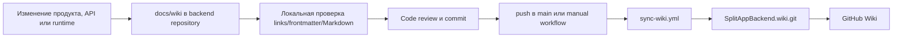

# Поддержка Wiki

`docs/wiki/` — единственный редактируемый источник документации SplitApp Backend. GitHub Wiki — опубликованное зеркало, а не место для независимых правок. Исходники доступны в [репозитории](https://github.com/Strongf-bob/SplitAppBackend/tree/main/docs/wiki), опубликованная Wiki — на [GitHub](https://github.com/Strongf-bob/SplitAppBackend/wiki).



## Источник и зеркало

| Артефакт | Роль | Как с ним работать |
|---|---|---|
| [`docs/wiki/`](https://github.com/Strongf-bob/SplitAppBackend/tree/main/docs/wiki) | Канонический Markdown-источник в code review. | Редактировать только здесь в обычной ветке backend-репозитория. |
| [`SplitAppBackend.wiki.git`](https://github.com/Strongf-bob/SplitAppBackend.wiki.git) | Git-репозиторий опубликованного зеркала. | Не вносить независимые смысловые правки: они будут перезаписаны следующей синхронизацией. |
| [GitHub Wiki](https://github.com/Strongf-bob/SplitAppBackend/wiki) | Читаемая опубликованная версия. | Проверять навигацию и публикацию после sync. |
| [sync-wiki.yml](https://github.com/Strongf-bob/SplitAppBackend/blob/main/.github/workflows/sync-wiki.yml) | Автоматически копирует `docs/wiki/*.md` и коммитит зеркало. | Запускается при изменении Wiki/core contract файлов на `main`, ежедневно и вручную. |

Workflow удаляет только верхнеуровневые Markdown-страницы зеркала и копирует туда все `docs/wiki/*.md`; это видно в [sync-wiki.yml:28-52](https://github.com/Strongf-bob/SplitAppBackend/blob/main/.github/workflows/sync-wiki.yml#L28-L52). Поэтому новая страница должна лежать прямо в `docs/wiki/`, иметь расширение `.md` и быть самодостаточной.

## Порядок изменения

1. Найдите владельца факта: продуктовый сценарий, API-contract, security rule, data model или operations. Wiki не должна пересказывать предположение, если источник уже определён в коде или контракте.
2. Обновите релевантную страницу и входящие ссылки. Если меняется поведение API, в том же изменении должны быть схемы, OpenAPI времени выполнения, `openapi.yaml`, регрессионные тесты и документация. [Руководство по API](API-Guide#порядок-совместимого-изменения-контракта)
3. Используйте стабильное имя файла в `Pascal-Case-With-Hyphens.md`; это же имя без `.md` является внутренней ссылкой GitHub Wiki.
4. Добавьте YAML frontmatter с `title` и `description`, один H1, точные source links для проверяемых технических утверждений и раздел `Related Pages`/`Связанные страницы`.
5. Для сложного потока применяйте Mermaid: diagram объясняет зависимость или последовательность, а не дублирует таблицу. Под diagram добавляйте комментарий с source files/line ranges.
6. Внешнюю ссылку на файл репозитория оформляйте полным GitHub URL и сохраняйте `.md`; для ссылки между Wiki-страницами используйте имя страницы без `.md`, например `[API guide](API-Guide)`.
7. Проверьте локально, включите документацию в осмысленный Conventional Commit и отправьте ветку на review.

## Локальная проверка документации

Перед commit выполните проверки из этого набора. Они не заменяют review фактов, но предотвращают битые ссылки, неполный frontmatter и типовые Markdown-ошибки.

```bash
# Markdown-файлы должны иметь title, description и ровно один H1 вне fenced blocks.
python3 - <<'PY'
from pathlib import Path

for path in Path("docs/wiki").glob("*.md"):
    lines = path.read_text(encoding="utf-8").splitlines()
    if not lines or lines[0] != "---":
        raise SystemExit(f"Missing frontmatter: {path}")
    try:
        end = lines.index("---", 1)
    except ValueError:
        raise SystemExit(f"Unclosed frontmatter: {path}")
    fields = lines[1:end]
    if not any(line.startswith("title:") for line in fields):
        raise SystemExit(f"Missing title: {path}")
    if not any(line.startswith("description:") for line in fields):
        raise SystemExit(f"Missing description: {path}")
    fenced = False
    h1_count = 0
    for line in lines[end + 1:]:
        if line.startswith("```"):
            fenced = not fenced
        elif not fenced and line.startswith("# "):
            h1_count += 1
    if h1_count != 1:
        raise SystemExit(f"Expected one H1 outside fences in {path}, got {h1_count}")
PY

# Внутренние Wiki targets должны существовать в docs/wiki/.
python3 - <<'PY'
import re
from pathlib import Path

pages = {path.stem for path in Path("docs/wiki").glob("*.md")}
missing = set()
for path in Path("docs/wiki").glob("*.md"):
    text = path.read_text(encoding="utf-8")
    for target in re.findall(r"\[[^\]]+\]\(([^)]+)\)", text):
        target = target.split("#", 1)[0]
        if target and "://" not in target and not target.startswith("/") and not target.endswith(".md"):
            if target not in pages:
                missing.add(f"{path}: {target}")
if missing:
    raise SystemExit("Missing Wiki targets:\n" + "\n".join(sorted(missing)))
PY

# Проверка whitespace и текущего состояния Markdown-диффа.
git diff --check -- docs/wiki
```

Проверяйте anchors вручную при изменении заголовков: GitHub Wiki формирует fragment из заголовка, а локальная проверка выше подтверждает только существование страницы. Для диаграмм просматривайте fenced block на корректный тип (`flowchart`, `sequenceDiagram`, `stateDiagram-v2`, `erDiagram`) и сверяйте его с описываемым source.

## Публикация зеркала

Обычный путь — merge/push в `main`: workflow синхронизации срабатывает по фильтрам путей, указанным в [sync-wiki.yml:1-24](https://github.com/Strongf-bob/SplitAppBackend/blob/main/.github/workflows/sync-wiki.yml#L1-L24). Если нужна внеочередная публикация, запустите `Sync docs/wiki to GitHub Wiki` через `workflow_dispatch` в Actions. После job:

1. Откройте [GitHub Wiki](https://github.com/Strongf-bob/SplitAppBackend/wiki) и перейдите по Home/новым страницам.
2. Проверьте run workflow и commit, созданный в зеркальном репозитории.
3. Если зеркало не обновилось, исправляйте source/workflow credentials или GitHub Wiki settings; не делайте ручную смысловую правку только в `.wiki.git`.

## Контрольный список review

- [ ] Факт подтверждён кодом, `openapi.yaml`, Compose/CI config или явным product decision.
- [ ] Техническое утверждение имеет точную source link; продуктовая страница не выдаёт план за реализованную возможность.
- [ ] Все внутренние ссылки ведут на существующие имена Wiki-страниц; внешние repo links сохраняют `.md`.
- [ ] Есть frontmatter, один H1, понятные заголовки и связанные страницы.
- [ ] При изменении API/security/operations соответствующие contract, tests и docs обновлены вместе.
- [ ] Выполнены локальные Markdown/link checks и `git diff --check`.

## Связанные страницы

| Страница | Связь |
|---|---|
| [Онбординг](Onboarding) | Маршрут авторов и читателей документации. |
| [Руководство по API](API-Guide) | Правило синхронного изменения API-контракта. |
| [Тесты и CI](Testing-And-CI) | Общие локальные и CI проверки. |
| [Операции и деплой](Operations-And-Deployment) | Publication/deploy workflow и наблюдаемость. |
